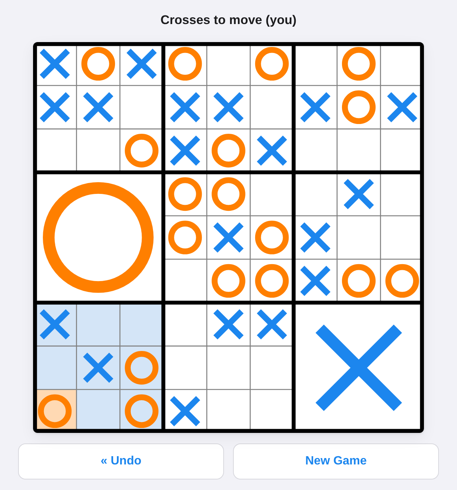

# TicTacToe Ultimatum

Ultimate Tic-Tac-Toe as a single page web application: a TypeScript port of the
[iOS app of the same name](https://github.com/mkhrapov/tictactoe-ultimatum).

Play a friend across the same screen, or play the computer. Everything — the
rules, the Monte Carlo search that drives the AI, the board drawing — runs in
the browser. There is no backend: the build output is a folder of static files
that can be served from anywhere.



## What it does

- **Two humans, or a human against the AI**, with the AI on either side.
- **Five AI levels.** Level 1 answers at random; levels 2 to 5 run a Monte Carlo
  search with 100, 200, 400 and 1000 playouts per candidate move.
- **The AI thinks in a Web Worker**, so the board never freezes and the page
  stays responsive while it searches.
- **Undo**, following the rule of the original app: one ply against another
  human, two against the AI, so an undo always hands the move back to you.
- **The game and the settings survive a reload**, kept in `localStorage`.
- **Mouse, touch and keyboard.** Arrow keys move a cursor on the board and Enter
  or Space plays the cell under it.
- **Responsive and theme-aware**, from a 320px phone to a desktop window, in
  light and dark.

## Running it

```sh
npm install
npm run dev        # development server
npm test           # unit tests
npm run build      # static site in dist/
npm run preview    # serve the built site
npm run bench      # time the search at its heaviest
```

`npm run build` writes `dist/`. Asset URLs in the build are relative, so the
folder works unchanged at a domain root, in a subdirectory, or on GitHub Pages
under `/<repo>/`. Serve it with any static file server; no rewrite rules are
needed, because routing happens in the URL fragment (`#/play`, `#/settings`,
`#/rules`).

To publish it on GitHub Pages: enable Pages for the repository (Settings →
Pages → Source: GitHub Actions), then run the **Deploy to GitHub Pages**
workflow from the Actions tab.

## How it is put together

Nothing but the toolchain is a dependency: no UI framework, no game library.

| Module | What it holds | Ported from |
| --- | --- | --- |
| `src/game/constants.ts` | Marks, the nine sections, the eight lines | `BoardState.swift` |
| `src/game/boardState.ts` | One position: cells, open sections, whose turn, who won | `BoardState.swift` |
| `src/game/game.ts` | Move history, undo rules, whose turn it is | `ViewController.swift` |
| `src/ai/packedState.ts` | The position as a flat byte array, for the search | `BoardStateInt8.swift`, `monte_carlo_tree_search.c` |
| `src/ai/mcts.ts` | Playouts, the dumb-move filter, move scoring | `monte_carlo_tree_search.c` |
| `src/ai/ai.ts` | Level to playout count, the immediate win, the opening move | `AI.swift` |
| `src/ai/worker.ts`, `src/ai/engine.ts` | Running the search off the main thread | the `DispatchQueue` hop in `ViewController.swift` |
| `src/ui/boardRenderer.ts` | Drawing the board on a canvas | `BoardView.swift` |
| `src/ui/playView.ts` | The board screen | `ViewController.swift` |
| `src/ui/settingsView.ts` | The settings screen | `SettingsViewController.swift` |
| `src/ui/rulesView.ts` | How to play | `www/how_to_play.html` |
| `src/settings.ts` | Settings and the saved game | `UserDefaults` |

### The search

The original ran its Monte Carlo search in C, copying a 101-byte
`board_state` struct with `memcpy` for every playout. The port keeps that shape:
positions handed to the search are a flat `Int8Array` of the same layout, copied
with `TypedArray.set`, and the hot loop allocates nothing. The one deliberate
change is in how legal moves are collected during playouts — only the sections
open for play are scanned, rather than all 81 cells, which is about 2.5 times
faster and picks from exactly the same set of moves.

The search itself is unchanged: filter out moves that hand the opponent an
immediate win, then, if more than one survives, play each of them out at random
`iterations` times and keep the highest scoring one. A win scores 1.0 and a draw
0.05.

### Differences from the iOS app

- The C code fell back to cell 0 when every playout was lost, which could
  return an illegal move; the port falls back to the first surviving candidate
  instead.
- The status line above the board, the move preview under the pointer, the
  keyboard cursor, and saving the game across a reload are new — a browser tab
  gets reloaded far more often than an app gets killed.
- A game already under way is no longer restarted when the game style changes;
  the new style applies to the next new game.

## Tests

```sh
npm test
```

The suite covers the rules (sending the opponent to a section, winning a
section, wildcard play, winning and drawing the board), the undo rules for each
game style, the AI (it takes a win it can see, it never returns an illegal move,
it does not hand the opponent an immediate win when it has a choice), and checks
that the packed board the search runs on stays in step with `BoardState` move
for move across complete games.

## License

Apache License 2.0, as the original. See [LICENSE](LICENSE).

Copyright © 2019 Max Khrapov.

If you like Ultimate Tic-Tac-Toe, the author's later game
[Sansumoku](https://www.sansumoku.com) crosses it with Sudoku.
